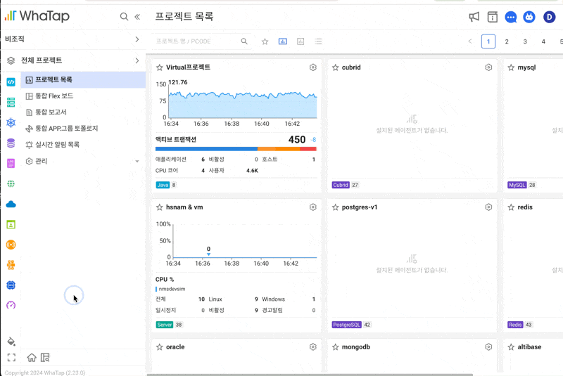

# WhaTap Quick Navigation

WhaTap 모니터링 서비스에서 `Cmd+K` (Windows: `Ctrl+K`)로 빠르게 메뉴를 탐색하는 Chrome 확장 프로그램입니다.




## 주요 기능

- **빠른 검색**: 퍼지 검색으로 메뉴 이름 일부만 입력해도 찾기
- **양방향 탐색**: 메뉴 먼저 또는 프로젝트 먼저, 원하는 순서로 이동
- **빈도 기반 정렬**: 자주 가는 메뉴/프로젝트가 자동으로 상단에
- **한글 지원**: "홈", "메인", "대시보드" 등 한글 별칭 검색 가능

## 설치 방법

### GitHub Release에서 설치

1. [Releases](https://github.com/kyupid/whatap-shortcut/releases) 페이지에서 `whatap-quick-nav.zip` 다운로드
2. 압축 해제
3. Chrome에서 `chrome://extensions` 접속
4. 우측 상단 **개발자 모드** 활성화
5. **압축해제된 확장 프로그램을 로드합니다** 클릭
6. 압축 해제한 폴더 선택

### 소스에서 설치 (개발용)

```bash
git clone https://github.com/kyupid/whatap-shortcut.git
```

이후 위와 동일하게 `chrome://extensions`에서 폴더 로드

## 사용법

| 단축키 | 동작 |
|-------|------|
| `Cmd+K` / `Ctrl+K` | 모달 열기/닫기 |
| `↑` `↓` | 항목 이동 |
| `Enter` | 선택 |
| `Backspace` | 이전 단계로 |
| `ESC` | 검색어 지우기 → 모달 닫기 |

### 탐색 흐름

첫 화면에서 **메뉴와 프로젝트를 통합 검색**할 수 있습니다. 원하는 방식으로 탐색하세요:

**방법 1: 메뉴 먼저 선택**
```
Cmd+K → 메뉴 선택 → 프로젝트 선택 → 페이지 이동
```

**방법 2: 프로젝트 먼저 선택**
```
Cmd+K → 프로젝트 선택 → 메뉴 선택 → 페이지 이동
```

Global 메뉴 (프로젝트 목록, 계정 관리 등)는 프로젝트 선택 없이 바로 이동합니다.

## 지원 메뉴

- **APM**: 애플리케이션 대시보드, 트랜잭션 맵, 히트맵 등
- **Server**: 리소스 보드, 서버 목록 등
- **Database**: 인스턴스 모니터링, 슬로우 쿼리, 락 트리 등
- **Kubernetes**: 컨테이너 맵, 노드 목록, Pod 목록 등
- **Browser/Mobile**: RUM 대시보드, 에러 트래킹 등
- **Network**: 토폴로지, TCP/UDP 세션 등
- **Log**: 라이브 테일, 로그 검색 등
- **Cloud**: AWS 리소스 모니터링 등

## 기술 스택

- Chrome Extension Manifest V3
- Vanilla JavaScript
- CSS Variables (WhaTap 브랜드 컬러)

## 데이터 저장

모든 데이터는 브라우저 로컬에만 저장됩니다:

| 키 | 용도 |
|----|------|
| `whatap_qn_visits` | 메뉴 방문 횟수 |
| `whatap_qn_project_visits` | 프로젝트 방문 횟수 |
| `whatap_qn_projects` | 프로젝트 목록 캐시 |

## 라이선스

MIT
